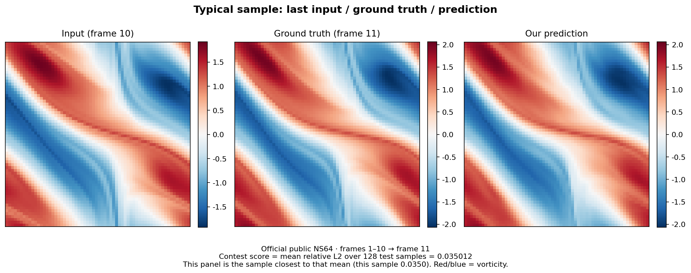
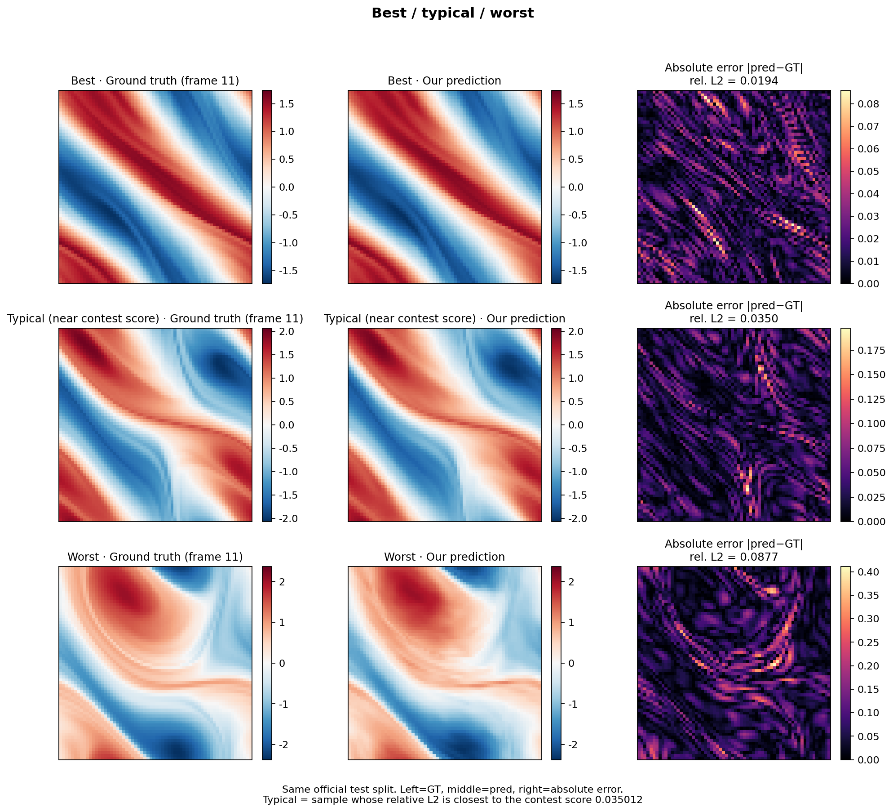

# FanDou Garden · Spectral Convolution + FNO-NS

<p align="left">
  <b>Shusheng Guozhi Science Challenge</b> · Biren Flying Cup · Track 5 (Models &amp; Operators)<br/>
  Team: <b>FanDou Garden</b> · North University of China<br/>
  Submission repo: <a href="https://github.com/junfennie162-sketch/birensupa-spectralconv">junfennie162-sketch/birensupa-spectralconv</a><br/>
  Team mirror: <a href="https://github.com/Aafff623/fandou-ai4s">Aafff623/fandou-ai4s</a>
</p>

If this tree helps you write operators on a domestic GPU, train a neural operator, or run an Agent-backed performance loop, please **Star** the repo so the next person can find it:

https://github.com/junfennie162-sketch/birensupa-spectralconv

On one **Biren106B** card we implement FNO's core 2D **Spectral Convolution** with **SUPA + a PyTorch extension** (contest Route 2), then assemble **four** Fourier layers for public-set vorticity prediction on 2D incompressible Navier–Stokes. Cursor / Biren Agent logs are part of the submission.

> 仓库简介：BIREN SUPA 上的 2D Spectral Convolution（裁剪 DFT + 设备复数乘 + 裁剪 iFFT）+ 四层 FNO-NS。公开 NS64 L2 **0.035012**；算子默认路径 worst rel **7.16e-6**，**0.764 / 1.827 / 6.504 ms** @64/128/256；FNO batch-16 **5.26M** grid points/s。

---

## Reported scores

| 主报项 | 现行值 |
|--------|--------|
| 公开 NS64 相对 L2 | **0.035012** · tag `spec_ref_r2` · **v10** |
| Spectral 64 / 128 / 256 | **0.764 / 1.827 / 6.504 ms**（`pipe_b_r1` · **v12** · 2026-08-16；上一主表 0.762/1.981/7.324） |
| Spectral 正确性 worst rel | 默认裁剪路径 **7.16×10⁻⁶**（阈值 `1e-4`；suFFT 三案 2.17×10⁻⁷） |
| Checkpoint | `fno_ns/checkpoints/fno_ns_public_demo.pt` |
| Phase | `submit_gate` done |

> **GitHub 下载交卷包**：[`contest_submit/`](contest_submit/) 提供**英文单包**（约 40MB；不含公开 NS `.pt`）。完整 2.9G 工作区 tar 无法入库。

Reproduce with `bash scripts/validate.sh`. Do **not** run `test_perf.py` unless the GPU is idle and you intend to rewrite `summary.json`.

---

## Visuals (official public NS64, same checkpoint)

These two figures are rendered from the official test split with `fno_ns/render_official_demo.py`. They are not sketches and not synthetic data.

| Typical sample (L2 closest to 0.035012) | Best / typical / worst |
|---|---|
| [](demo/media/01_typical_sample_pred_vs_gt.png) | [](demo/media/02_best_typical_worst.png) |

---

## Quick validation on BIREN

```bash
source /usr/local/birensupa/sdk/1.11.0.0.rc2/scripts/brsw_set_env.sh
export SUPA_BASE=/usr/local/birensupa/sdk/1.11.0.0.rc2

# 推荐：一键复现裁剪 DFT（不写正式 idle）
./scripts/reproduce.sh

# 或分步
cd spectral_conv && ./build.sh
python3 test_accuracy.py          # 相对误差 ≤ 1e-4
# python3 test_perf.py            # 空闲独占才跑；会写正式 idle

cd ../fno_ns && python3 test_forward.py
python3 test_chain_cpu_supa_consistency.py
```

That command sources the SDK, builds the extension, runs the official 3-case accuracy test, times the unofficial pruned path, and dry-runs the OPT-loop gates. It **does not** call `test_perf.py`.

Public-set FNO evaluation needs the official tensor (not shipped; ~376 MB):

```bash
# place navier_stokes_v1e-3_N1200_T20.pt under fno_ns/data/
cd fno_ns && python3 render_official_demo.py
```

Downloadable pack (English only): [`contest_submit/`](contest_submit/).

---

## Repository layout

We keep contest names `spectral_conv/` and `fno_ns/` rather than renaming the tree to `project/`. Clone root **is** the submission root.

| Path | What it is |
|------|------------|
| [`skill.md`](skill.md) | One-file Skill (start here for the method) |
| [`AGENT_OFFICIAL.md`](AGENT_OFFICIAL.md) | Agent audit page (contest scoring item) |
| [`development_log.md`](development_log.md) | Full Agent log (original Chinese; English banner at top) |
| [`results.md`](results.md) | Same-protocol comparison + what we changed |
| `spectral_conv/` | Mandatory operator: pruned-DFT kernels, suFFT fallback, tests |
| `fno_ns/` | Four-layer FNO-NS; reuses the same operator |
| `scripts/validate.sh` | One-command BIREN check |
| `demo/media/` | Cover figures + `brsmi` snapshot |
| `results/summary.json` | Frozen formal numbers |
| `contest_submit/` | Single English tarball |

---

## Environment

| Item | Value |
|------|--------|
| GPU | Biren106B, **one card** |
| SDK | `1.11.0.0.rc2` |
| Device name | `device="supa"` (import `torch_br` first) |
| `torch.cuda.is_available()` | `False` is expected on this platform |

```bash
source /usr/local/birensupa/sdk/1.11.0.0.rc2/scripts/brsw_set_env.sh
export SUPA_BASE=/usr/local/birensupa/sdk/1.11.0.0.rc2
brsmi   # confirm the card is free before any GPU job
```

Do not run two SUPA jobs at once (ErrorCode 719; timings become junk).

---

## Operator (mandatory Spectral Convolution)

Input `x: [B, C_in, H, W]` with configurable `modes1/modes2`. Default path:

```text
width mixed-radix rFFT (kept bins only)
  → height dual-corner DFT (top/bottom modes1)
  → SUPA complex multiply (same dual-corner truncation as the official reference)
  → inverse height + inverse width pruned iFFT
→ y: [B, C_out, H, W]
```

`SPECTRAL_PRUNED_FFT=0 SPECTRAL_PRUNED_INV=0` falls back to device-resident suFFT R2C → SUPA mul → C2R (the frozen formal idle board).

Correctness is always against `spectral_conv/reference_pytorch.py` (CPU dual-corner reference). Bonus tests: backward, 3D four-corner, irregular shapes. They do not change the mandatory protocol.

### 3.2 正确性

```bash
cd spectral_conv
python3 test_accuracy.py
```

- **Reference：** 官网风格双角 spectral conv（`reference_pytorch`）
- **阈值：** 相对误差 ≤ `1e-4`
- **现行 formal：** worst rel ≈ **2.17e−7**（64×64 目标 case）

### 3.3 性能

```bash
cd spectral_conv
python3 test_perf.py
```

| 分辨率 | formal idle |
|--------|-------------|
| 64×64 | **0.764 ms** |
| 128×128 | **1.827 ms** |
| 256×256 | **6.504 ms** |

配置：warmup=`10` · iters=`100` · 同步 wall-clock。

> **纪律：** 现行主表是裁剪 DFT CPU 入 KEEP。无空闲独占证明前，不要默认重跑 `test_perf.py` 把数写回旧 suFFT 板。

<details>
<summary>分段旁注（非第二套正式得分）</summary>

<br/>

- 应用层观测：C2R 约占 device 段 **60%–70%**
- `mul_scatter` 已近噪声量级
- CPU 加速比等仅作口播旁注
- **禁止**写成 SOL / 官方得分句
- 口播卡片：[六轴口播](results/run_logs/SPECTRAL_SIX_AXIS_ORAL_2026-08-04.md)

</details>

### 3.4 扩展抽查（加分项，不替代主报）

| 扩展 | 命令 | 现行 |
|------|------|------|
| Backward | `python3 test_backward.py` | worst grad rel ≈ 6.3e−8 |
| SpectralConv3d 四角 | `python3 test_3d_accuracy.py` | worst ≈ 1.19e−7（**≠** 完整 3D FNO） |
| 非规则分辨率 | `python3 test_irregular_shapes.py` | 9/9 pass |
| 自动调优 | `tune.py` + `tune_results.json` | 决策可复现 |

抽查入口：[`SPECTRAL_BONUS_AUDIT_CARD.md`](results/run_logs/SPECTRAL_BONUS_AUDIT_CARD.md)

</details>

---

## FNO-NS (advanced)

Four Fourier layers, `width=32`, `modes=16`, 64×64. Task: **10 input frames → frame 11** on the **unmodified** official file `navier_stokes_v1e-3_N1200_T20.pt` (train 1000 / test 128, seed `20260722`). Inference calls the same SpectralConv; we do not ship a second FFT.

On that official split: **0.041835 → 0.035012**. Residual head, periodic shifts, spectral-weight fine-tune, Sobolev H⁻¹ high-frequency loss. Long training stays on CPU (`use_supa=False`).

---

## Agent / Skill

<br/>

### 5.1 编译必选算子

```bash
cd /workspace/ai4s-f/submission
source /usr/local/birensupa/sdk/1.11.0.0.rc2/scripts/brsw_set_env.sh
export SUPA_BASE=/usr/local/birensupa/sdk/1.11.0.0.rc2

cd spectral_conv
./build.sh
# 预期：Extension 链接成功，进程 exit 0
```

### 5.2 正确性（Spectral）

```bash
cd spectral_conv
python3 test_accuracy.py
# 预期：全部 case ok；max_rel ≤ 1e-4
# 现行 formal worst ≈ 2.17e-7
```

可选加强抽查：

```bash
python3 test_sufft_accuracy.py
python3 test_backward.py
python3 test_3d_accuracy.py
python3 test_irregular_shapes.py
```

### 5.3 性能（Spectral）

```bash
cd spectral_conv
python3 test_perf.py
# 三档 64/128/256；正式板已冻结，交卷勿无故覆写
```

现行主表：**0.764 / 1.827 / 6.504 ms**（`pipe_b_r1` · v12 · 2026-08-16）。上一主表 0.762 / 1.981 / 7.324。

### 5.4 FNO 前向与可视化

```bash
cd /workspace/ai4s-f/submission/fno_ns
python3 test_forward.py     # ≥4 层；报告相对 L2
python3 visualize.py        # 刷新 figures / demo media
```

### 5.5 推荐总回归

```bash
cd /workspace/ai4s-f/submission

./scripts/run_tests.sh              # 主链路（推荐）
./scripts/run_tests.sh all          # 更全串行回归
./scripts/run_tests.sh sufft        # suFFT 正确性
./scripts/run_tests.sh fno-chain    # CPU vs SUPA，rel ≤ 1e-4
./scripts/run_tests.sh fno-batch16  # batch=16 吞吐
./scripts/run_demo.sh

python3 skills/operator_opt_loop/run_loop.py --dry-run --strict
./scripts/maintain_assets.sh check submit_gate
```

| # | 场景 | 命令 | 通过标准 |
|---|------|------|----------|
| 1 | 改 `.su` / `.cpp` / `build.sh` | `build.sh` + `test_accuracy.py` | rel ≤ `1e-4` |
| 2 | 关心算子速度 | `test_perf.py`（慎写 formal） | 三档 ms 可复现 |
| 3 | 改 FNO 模型 | `test_forward.py` / `fno-chain` | 前向成功；chain ≤ `1e-4` |
| 4 | 交卷前 | `run_tests.sh` + `run_loop --strict` + `maintain check` | exit 0 / PASS |

**预期输出落点：**

- `results/summary.json`
- `results.md`
- `results/run_logs/`
- `demo/media/`

### 5.6 FNO 吞吐（工程旁注）

| 项 | 现行 |
|----|------|
| batch=16 纯前向 | ≈ **1.60M** grid_points/s · ≈391 samp/s · peak≈202 MB |
| 训练吞吐（加分） | ≈ **3.47×10⁴** grid_points/s（CPU / `use_supa=False`，含 loss+bwd+opt） |

须先通过 chain 一致性；未过门禁的快速数字不进正式叙述。

</details>

---

## Limits

<br/>

```text
submission/
├── README.md                 # 本文件
├── skill.md                  # 官方必须 Skill 入口
├── SUBMISSION_CHECKLIST.md   # 官方条目 ↔ 路径对照
├── FILE_CONVENTIONS.md       # 现行 / 历史 / 归档约定
├── development_log.md        # Agent 日志（必须 ≥5 段）
├── results.md                # 正确性与性能汇总正文
├── spectral_conv/            # 必选算子：.su / .cpp / build / tests
├── fno_ns/                   # FNO 模型、数据、训练、可视化、诊断
├── scripts/                  # setup / run_tests / run_demo / maintain_assets
├── skills/                   # Agent Skills + operator_opt_loop
├── demo/                     # SCP + media（评委展示）
└── results/                  # summary · phase_status · run_logs · figures
```

| 路径 | 职责 |
|------|------|
| `spectral_conv/` | SUPA kernel、Extension、正确性 / 性能 / 扩展测试 |
| `fno_ns/` | FNO-NS、公开集协议、promote 门禁、Autopsy / PF 探针 |
| `results/run_logs/` | 轮次计划、对齐卡、JUDGE 包、实验摘要 |
| `skills/operator_opt_loop/` | P0–P6 规范闭环（`--dry-run --strict`） |

</details>

---

<details>
<summary><b>7. 关键实测摘要</b></summary>

<br/>

| 项 | 结果 |
|----|------|
| SpectralConv rel（formal） | 默认路径 **7.16e−6** ≤ `1e-4` |
| Spectral 64/128/256 | **0.764 / 1.827 / 6.504 ms** |
| spectral_mul backward | worst ≈ 6.3e−8 |
| SpectralConv3d（四角） | worst ≈ 1.19e−7 |
| FNO 层数 | **4** |
| FNO 公开 NS64 L2 | **0.035012**（`spec_ref_r2` · v10） |
| FNO batch16 | ≈1.60M gps · peak≈202 MB |
| FNO 训练吞吐（旁注） | ≈3.47×10⁴ gps |
| 自建 v2（非公开） | ≈0.005144 |

表格化正文：[`results.md`](results.md)

</details>

---

<details open>
<summary><b>8. 精度线与工程纪律</b>（本队现状）</summary>

<br/>

### 8.1 Promote 门禁

```text
gate = live_best − 1e−4
例：0.035012 → gate 0.034912

仅当同时满足：
  (1) best < gate
  (2) 人工确认
才可 promote / 编评测报告新 v

自动链默认禁止无 gate promote
（promote_guard.py + ALLOW_AUTO_PROMOTE）
```

### 8.2 近期收口事实

| 实验 | 数字 | 处置 |
|------|------|------|
| `spec_ref_r2` | **0.035012** | **KEEP · 现行主报 v10** |
| `dualview_r2` | 0.035115 | 历史 v9 |
| `freeze_r9` | 0.035302 | 历史 v8 |
| freeze_r10 手跑 / autochain | 0.035287 / 0.035252 | 未破 gate；弱写入 **已回滚** |
| soft / hybrid / modes20 / A1 | Δ≈0 或差于主报 | NO_SIGNAL / KILL |
| Error Autopsy D（epochs=0） | ρ(e1,g)≈0.80；worst16∩=10 | 产出裁决与答辩三图 |
| `pf_clean_r1`（clean-anchor PF） | best **0.035216** | **NO_SIGNAL** · 差 gate≈1.4e−5 · **未 promote** |

### 8.3 红线

1. 禁止把 SOL / proxy / tune median 写成正式得分句
2. 禁止未破 gate 探针编入评测报告正式 v 号
3. 禁止 TTA、自建 v2、异构算子污染公开主报
4. 禁止 `ai4s-f` 与 `ai4s-n` 并发占用同一 GPU
5. 禁止无必要长挂训练；探针用 `nohup` + `--stop-on-gate`

</details>

---

<details>
<summary><b>9. Agent / Skills</b>（官方必须 · 约 15%）</summary>

<br/>

| 资源 | 说明 |
|------|------|
| [`development_log.md`](development_log.md) | ≥5 段有效交互；覆盖 kernel / 超参 / 平台 / 数据 / 可视化 / 瓶颈；精品含回滚门禁、材料闭环、Autopsy、PF |
| [`skill.md`](skill.md) | 官方必须总入口 |
| `skills/spectral_conv_dev` | 算子构建与排错 |
| `skills/fno_experiment` | FNO 实验与指标 |
| `skills/operator_opt_loop` | OPT P0–P6；见 `LOOP_PROCESS.md` |

```bash
python3 skills/operator_opt_loop/run_loop.py --dry-run --strict
```

</details>

---

<details open>
<summary><b>10. 已知限制</b>（官方 README 必填）</summary>

<br/>

1. **正式 Spectral 路径为 fused**；v1 仅对照 / 训练后备，不以 v1 性能板替代 formal idle。
2. **Formal idle ms 冻结**；分段占比、CPU 加速比为旁注叙事。
3. **公开主报协议**为 HF `N1200_T20` 上 clean 单步 10→1（1000/128）；与论文 T=50 轨迹指标不可横比。
4. **自建 v2** 仅工程对照，不计公开分。
5. **SpectralConv3d / irregular** 为算子扩展抽查，不代表完整 3D FNO 求解器。
6. **FNO device-resident 性能**须先通过 CPU↔SUPA chain 门禁（rel≤`1e-4`）。
7. **精度线已永久停训**；后续以答辩材料与可复现回归为主，不再默认开同构抛光 / STLW / 扩 modes。
8. 完整 `run_tests.sh` 为数分钟量级（**不含**无故重跑 formal perf）。

</details>

---

<details>
<summary><b>11. 展示材料</b>（建议项 · 已准备）</summary>

<br/>

| 材料 | 路径 |
|------|------|
| 评委一页包 | `results/run_logs/JUDGE_3MIN_PACK_2026-08-04.md` |
| PPT 页冻结稿 | `results/PPT答辩冻结稿_2026-08-04.md` |
| 六轴口播 | `results/run_logs/SPECTRAL_SIX_AXIS_ORAL_2026-08-04.md` |
| 流场与解剖图 | `demo/media/` |
| 90s 分镜 | `results/run_logs/demo_storyboard_90s.md` |
| 资产对齐卡 | `results/run_logs/OFFICIAL_ASSET_ALIGNMENT_2026-08-04.md` |

</details>

---

<details>
<summary><b>12. 外部文档</b></summary>

<br/>

- 《算子与模型赛道选手手册》  
  `/workspace/赛题文档/算子与模型赛道选手手册.md`  
  （README 最低字段见「提交要求 · README.md」）
- 官网赛道五详情  
  `/workspace/赛题文档/官网-赛道五-模型与算子详情页.md`  
  （统一要求 / 提交规范）
- 工作区约定  
  `/workspace/ai4s-f/AGENTS.md` · `/workspace/AGENTS.md`

</details>

---

## 附录

<details>
<summary><b>A. 一页命令速查</b></summary>

<br/>

```bash
# ---------- 环境 ----------
source /usr/local/birensupa/sdk/1.11.0.0.rc2/scripts/brsw_set_env.sh
export SUPA_BASE=/usr/local/birensupa/sdk/1.11.0.0.rc2

cd /workspace/ai4s-f/submission
./scripts/setup_env.sh

# ---------- 必选 ----------
cd spectral_conv && ./build.sh && python3 test_accuracy.py
# python3 test_perf.py   # formal 已冻结，交卷勿默认覆写

# ---------- 进阶 ----------
cd ../fno_ns && python3 test_forward.py && python3 visualize.py

# ---------- 总回归 + 材料 ----------
cd ..
./scripts/run_tests.sh
./scripts/run_demo.sh
python3 skills/operator_opt_loop/run_loop.py --dry-run --strict
./scripts/maintain_assets.sh check submit_gate
```

</details>

<details>
<summary><b>B. GPU / SUPA 职责划分</b></summary>

<br/>

| 环节 | 承担 |
|------|------|
| SpectralConv kernel | 频域复数乘（SUPA Extension） |
| 正式前向 | suFFT R2C → SUPA mul（常驻）→ suFFT C2R |
| FNO Fourier Layer | 复用 fused 双角 API |
| 训练路径 | CPU torch 可微（`use_supa=False`） |
| FFT v1 对照 | CPU torch FFT |

</details>

<details>
<summary><b>C. 官方 README 必填项对照</b></summary>

<br/>

手册「提交要求 · README.md」逐条对照：

| # | 官方要求 | 本文件位置 |
|---|----------|------------|
| 1 | 赛道与赛题（必选 + 进阶） | §1 |
| 2 | 开发路线 | §1 · 文首 |
| 3 | 运行设备与环境版本 | §2 |
| 4 | 核心自定义算子 / SUPA kernel | §3 |
| 5 | 编译命令 | §5.1 |
| 6 | 正确性测试与 reference | §3.2 · §5.2 |
| 7 | 性能测试命令 | §3.3 · §5.3 |
| 8 | 运行入口与预期输出 | §5 · 附录 A |
| 9 | 已知限制 | §10 |

</details>
