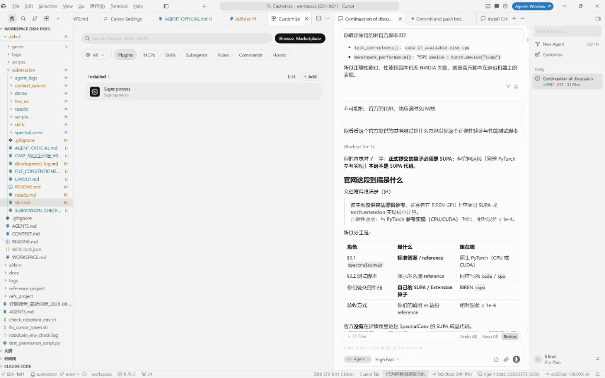
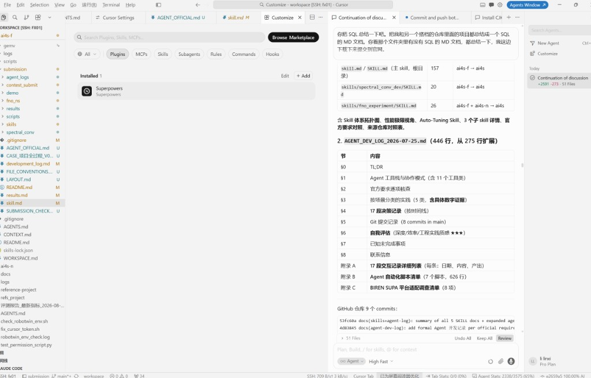
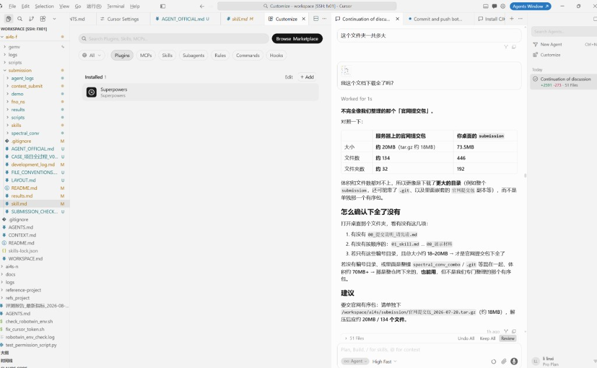

# Chat log · Cursor screenshot timeline

These 9 images are Cursor chat screenshots with the Agent (SSH `fx01`; the thread title is often *Continuation of discussion…*). The PNGs are unedited and live in this folder.

Two full chats were already converted from `.jsonl` (those files have exact clocks):

- [`01_2026-07-31_which_workspace.md`](01_2026-07-31_which_workspace.md)
- [`02_2026-08-02_optimization_round.md`](02_2026-08-02_optimization_round.md)

This page uses the same turn format (user words, then Agent reply). The screenshots do not show a system clock, so:

| Time | Meaning |
|------|---------|
| Date in each heading | **When the chat happened**, aligned with the screenshot content and `development_log.md` |
| Times marked “~” | Inferred, not a JSONL timestamp |
| Friday, Aug 14, 2026, 10:41 PM (UTC+8) | **When these 9 PNGs were captured/uploaded** |

Environment: Cursor Agent · SSH `fx01` · workspace `ai4s-f` · UI user li linxi.

- Screenshots: **9**
- Chat slices: **8** (shots 1 and 2 are two frames of the same topic)

---

## User 1 · Tuesday, Jul 21, 2026, ~evening (UTC+8)

Are you sure that is the official script?

That cannot be right — the official code should be SUPA.

## Agent 1

`test_correctness()` uses CPU / CUDA; `benchmark_performance()` is hardcoded to `torch.device("cuda")`. This machine has no NVIDIA GPU, so the official **perf** script fails because of that device pin — not because the contest operator is missing SUPA.

Submitted operators must be **SUPA / Extension** on Biren `supa`. The official “complete PyTorch reference” is the answer key, not ready-made SUPA source. Gate: relative error ≤ 1e-4 vs the reference. The site does not ship a finished SUPA `SpectralConv`.

| Role | What it actually is |
|------|---------------------|
| §3.1 Spectralconv2d reference | Native PyTorch (CPU or CUDA) |
| §3.2 test script | Measures that reference; also pinned to CUDA/CPU |
| Submission | Your own SUPA / Extension on Biren `supa` |
| Gate | vs reference, relative error ≤ 1e-4 |

**Screenshot (captured Friday, Aug 14, 2026, 10:41 PM UTC+8):**

---

## User 2 · Tuesday, Jul 21, 2026, ~evening (UTC+8)

Check this against our current deployment.

## Agent 2

Mapped the handbook to the tree at the time:

- Code quality ~10%: readability, modularity, SUPA / Extension quality
- Core kernels must be SUPA or `torch.extension`; native PyTorch alone is not enough
- Advanced tracks look at operator design / fusion and Biren hardware use
- Required: source, deps and build/run commands, correctness scripts+results, perf scripts+report, **run logs/screenshots**, Agent/Skill logs (≥5 records), `skill.md`; PPT/video optional
- Constraints: single-card reproducible; training ≤ 2 h; full eval script ≤ 30 min; perf must be verified on a Biren GPU

**Screenshot (captured Friday, Aug 14, 2026, 10:41 PM UTC+8):**

---

## User 3 · Friday, Jul 24, 2026, ~evening (UTC+8)

First compare the partner’s project with yours, then optimize this upgraded tree, then diff it.

## Agent 3

FNO chain was still ~**900+ ms** on the old default op; the partner hot path was about **93 ms**, with extra 3D / SOL-style eval scripts.

After the upgrade: packed fused core, `use_sufft="auto"`, plan warmup, stronger `test_perf` / `test_sol_style_perf`. The original entry point was left untouched. UI: “compare → optimize → Diff (done)”.

**Screenshot (captured Friday, Aug 14, 2026, 10:41 PM UTC+8):**

---

## User 4 · Saturday, Jul 25, 2026, ~afternoon (UTC+8)

Try it.

What is going on now? Why isn’t it running?

Alright, stop here. Summarize the remaining work into a document (same as yesterday).

## Agent 4

`RuntimeError: ERROR (SUDNN)` at `SudnnPlanBuilder.h:667`, ErrorCode 6, failed to finalize engine config. Even a trivial 32×32×32 1×1 conv failed on SUPA. That pointed to a **SUDNN / driver** break, not the business patch. Work stopped and remaining tasks were written up as requested.

**Screenshot (captured Friday, Aug 14, 2026, 10:41 PM UTC+8):**

---

## User 5 · Saturday, Jul 25, 2026, ~evening (UTC+8)

Summarize the Skill / Agent markdown from the other repo into one file for the official submission.

## Agent 5

Collected `skill.md` / `skills/spectral_conv_dev/SKILL.md` / `skills/fno_experiment/SKILL.md` and outlined `AGENT_DEV_LOG_2026-07-25.md` (~446 lines: TL;DR, tools, required checklist, scenario practice, decisions, git, self-score, open items). Related commits are visible at the bottom of the shot.

**Screenshot (captured Friday, Aug 14, 2026, 10:41 PM UTC+8):**

---

## User 6 · Saturday, Jul 25, 2026, ~evening (UTC+8)

(Same wrap-up round: R7 train / correctness / throughput. Agent listed five outcomes.)

## Agent 6

1. **FNO R7 sidecar**: 40 epochs; train L2 0.0062 → 0.00383; `candidate_rel_l2` **0.008768** (~7.86% vs the baseline then)
2. **SpectralConv R7**: correctness 5/5, worst relative error **2.17e-7**
3. **FNO batch=16**: ~1.37 M grid points/s pure forward; chain check passed
4. **SOL-style gap proxy**: memory-bound ~2.0–2.8 GB/s
5. New probes: `probe_sufft_provenance_r7.py`, `test_dual_accuracy.py`, `test_sufft_perf.py`, `train_r7_sidecar.py`, `test_chain_cpu_supa_consistency.py`, `benchmark_train_throughput.py`

These numbers match `development_log.md` record 23.

**Screenshot (captured Friday, Aug 14, 2026, 10:41 PM UTC+8):**

---

## User 7 · Tuesday, Jul 28, 2026, ~evening (UTC+8)

How big is this folder in total?

## Agent 7

The desktop `submission` folder was about **73.5 MB / 446 files / 192 folders**, which did not match the official pack (~20 MB, tar.gz ~18 MB, ~134 files). Likely a parent tree with `.git`. Suggested download: `官网提交包_2026-07-28.tar.gz` (~18 MB), and check `00_提交说明_请先读.md` through `08_展示材料`.

(The mainline pack later stamped `官网提交包_2026-07-29`; this screenshot names the 07-28 file.)

**Screenshot (captured Friday, Aug 14, 2026, 10:41 PM UTC+8):**

---

## User 8 · Friday, Aug 14, 2026, 10:17 PM (UTC+8)

Then the interaction log. I cannot open the two JSONL files in it. What should I do?

## Agent 8

JSONL is a machine log; keep the originals and emit chronological Markdown that opens in VS Code / Notepad / a browser:

1. [`01_2026-07-31_which_workspace.md`](01_2026-07-31_which_workspace.md)
2. [`02_2026-08-02_optimization_round.md`](02_2026-08-02_optimization_round.md)

The UI showed that reply about “9m ago”; capture time is the same evening as this upload.

**Screenshot (captured Friday, Aug 14, 2026, 10:41 PM UTC+8):**

---

## Timeline table

| # | Chat date | Heading (same style as 01/02) | File | Topic |
|---|-----------|-------------------------------|------|-------|
| 1–2 | 2026-07-21 | Tuesday, Jul 21, 2026, ~evening (UTC+8) | `screenshot_01` `screenshot_02` | Official ref is CPU/CUDA; submission must be SUPA |
| 3 | 2026-07-21 | Tuesday, Jul 21, 2026, ~evening (UTC+8) | `screenshot_03` | Required checklist vs current tree |
| 4 | 2026-07-24 | Friday, Jul 24, 2026, ~evening (UTC+8) | `screenshot_04` | Compare partner → optimize → Diff |
| 5 | 2026-07-25 | Saturday, Jul 25, 2026, ~afternoon (UTC+8) | `screenshot_05` | SUDNN ErrorCode 6; stop and write up |
| 6 | 2026-07-25 | Saturday, Jul 25, 2026, ~evening (UTC+8) | `screenshot_06` | Skill summary / `AGENT_DEV_LOG_2026-07-25.md` |
| 7 | 2026-07-25 | Saturday, Jul 25, 2026, ~evening (UTC+8) | `screenshot_07` | FNO R7 / SpectralConv R7 |
| 8 | 2026-07-28 | Tuesday, Jul 28, 2026, ~evening (UTC+8) | `screenshot_08` | Folder size vs official pack |
| 9 | 2026-08-14 | Friday, Aug 14, 2026, 10:17 PM (UTC+8) | `screenshot_09` | JSONL unreadable → Markdown |

PNG capture time for all nine: **Friday, Aug 14, 2026, 10:41 PM (UTC+8)**.
