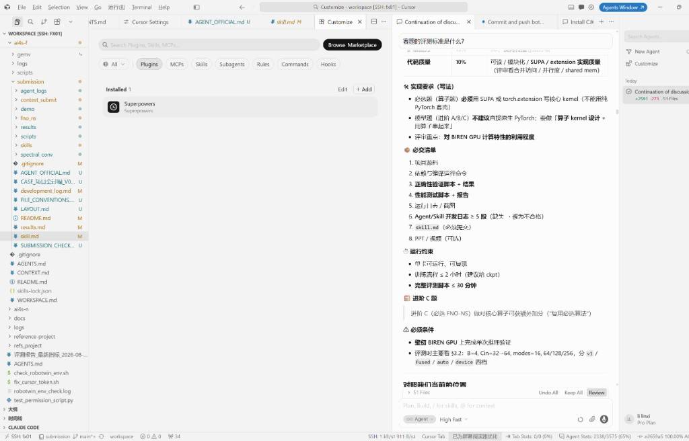
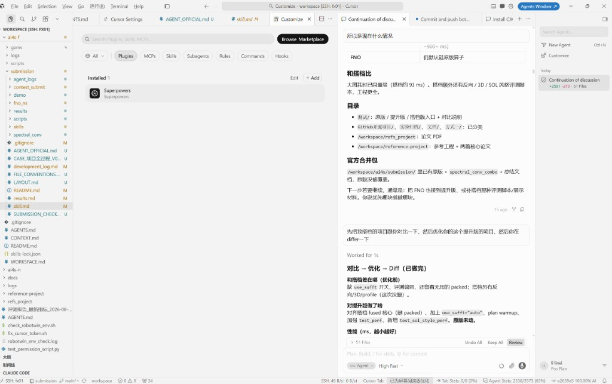
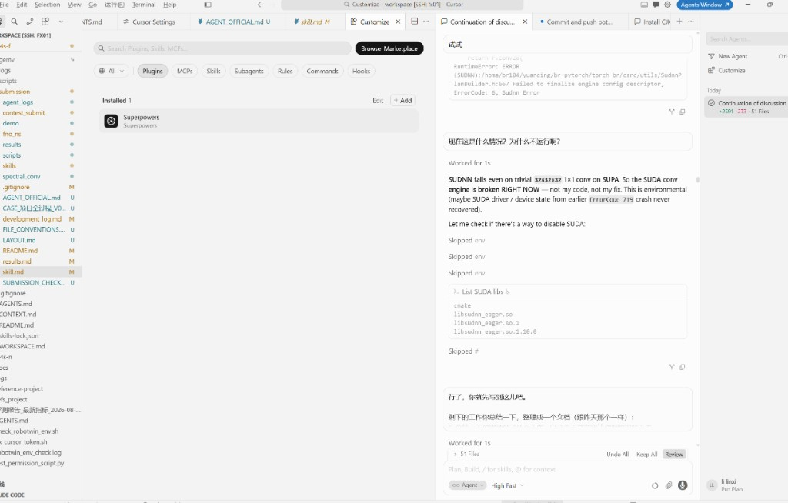
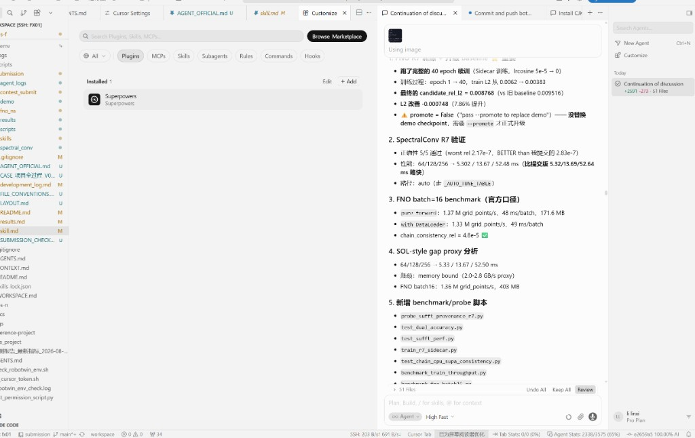
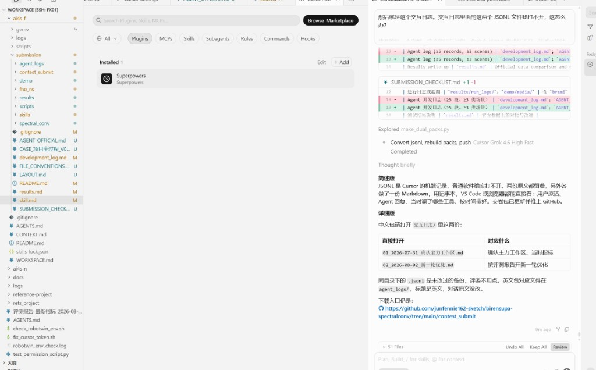

# 交互记录 · Cursor 聊天截图时间线

这 9 张图是 Cursor 里和 Agent 的聊天界面截图（SSH `fx01`，对话标题多为 *Continuation of discussion…*）。原图未改，放在本目录，评委可以直接打开。

同目录还有两份完整对话 Markdown（从 `.jsonl` 转出，带精确钟点）：

- [`01_2026-07-31_确认主力工作区.md`](01_2026-07-31_确认主力工作区.md)
- [`02_2026-08-02_新一轮优化.md`](02_2026-08-02_新一轮优化.md)

本页写法与上面两份相同：按时间写出用户原话、Agent 回复。区别只有一点——截图上没有系统时钟，所以：

| 时间 | 含义 |
|------|------|
| 各段标题里的日期 | **对话发生日**，对齐截图内容和 `development_log.md` |
| 标「约」的钟点 | 推算，不是 JSONL 里的精确戳 |
| Friday, Aug 14, 2026, 10:41 PM (UTC+8) | **这 9 张 PNG 的采集/上传时间**（本机） |

环境：Cursor Agent · SSH `fx01` · 工作区 `ai4s-f` · 用户界面显示 li linxi。

- 截图张数: **9**
- 覆盖对话: **8 段**（第 1、2 张是同一话题的两帧）

---

## 用户 1 · Tuesday, Jul 21, 2026, ~evening (UTC+8)

你确定用的是官方脚本吗？

不可能吧，官方的代码，他应该时SUPA吧

## Agent 1

`test_correctness()` 走 CPU / CUDA（有 CUDA 才用 GPU）；`benchmark_performance()` 写死 `torch.device("cuda")`。这台机器没有 NVIDIA GPU，所以官方**性能**脚本会失败，这是脚本本身的设备写死，不是选手算子没写 SUPA。

正式提交的算子必须是 **SUPA / Extension**，跑在壁仞 `supa` 上。官网上的「完整 PyTorch 参考实现」是对照答案，不是现成的 SUPA 代码。验收：选手输出相对参考，相对误差 ≤ 1e-4。官网没有把写好的 `SpectralConv` SUPA 源码发下来。

| 角色 | 实际是什么 |
|------|------------|
| §3.1 Spectralconv2d 标准答案 | 原生 PyTorch（CPU 或 CUDA） |
| §3.2 测试脚本 | 用来测这份参考，同样写死 CUDA/CPU |
| 选手提交 | 自己的 SUPA / Extension，跑 BIREN `supa` |
| 验收 | 相对参考 ≤ 1e-4 |

**截图（采集 Friday, Aug 14, 2026, 10:41 PM UTC+8）：**

---

## 用户 2 · Tuesday, Jul 21, 2026, ~evening (UTC+8)

对照我们当前的部署

## Agent 2

对照赛题打分和必交清单核对当时仓库：

- 代码质量约 10%：可读、模块化、SUPA / Extension 实现质量
- 核心 kernel 必须 SUPA 或 `torch.extension`，不能只交原生 PyTorch
- 进阶 A/B/C 重点看算子设计和融合，以及壁仞硬件特性有没有用上
- 必交：源码、依赖与编译运行命令、正确性脚本+结果、性能测试+报告、**运行日志/截图**、Agent/Skill 开发日志（≥5 段）、`skill.md`；PPT/视频可选
- 约束：单卡可复现；训练 ≤ 2 小时；全量评测脚本 ≤ 30 分钟；性能必须在 BIREN GPU 上验证

**截图（采集 Friday, Aug 14, 2026, 10:41 PM UTC+8）：**

---

## 用户 3 · Friday, Jul 24, 2026, ~evening (UTC+8)

先把搭档的项目跟你对比一下，然后优化你的这个升级版的项目，然后在你 differ 一下

## Agent 3

当时 FNO 链还约 **900+ ms**，仍走旧默认算子；搭档侧算子热路径大约 **93 ms** 一档，并且多了 3D / SOL 风格评测脚本。

优化后对齐搭档核心（packed 融合核、`use_sufft="auto"`、plan 预热、加强 `test_perf` / `test_sol_style_perf`），原版入口未改。界面显示「对比 → 优化 → Diff（已做完）」。

**截图（采集 Friday, Aug 14, 2026, 10:41 PM UTC+8）：**

---

## 用户 4 · Saturday, Jul 25, 2026, ~afternoon (UTC+8)

试试

现在这是什么情况？为什么不运行啊？

行了，你就先写到这儿吧。剩下的工作你总结一下，整理成一个文档（跟昨天那个一样）

## Agent 4

`RuntimeError: ERROR (SUDNN)`，`SudnnPlanBuilder.h:667`，ErrorCode 6，finalize engine config 失败。连 32×32×32 的平凡 1×1 conv 在 SUPA 上也过不了，当时判断是 **SUDNN / 驱动环境** 坏了，不是这一轮业务补丁写错。按用户要求停在这里，把剩余工作整理成文档。

**截图（采集 Friday, Aug 14, 2026, 10:41 PM UTC+8）：**

---

## 用户 5 · Saturday, Jul 25, 2026, ~evening (UTC+8)

把另一边仓库里和 Skill / Agent 相关的 MD 汇总成一份，给官方提交用。

## Agent 5

汇总当时的 Skill 文档（`skill.md` / `skills/spectral_conv_dev/SKILL.md` / `skills/fno_experiment/SKILL.md`），并按结构写出 `AGENT_DEV_LOG_2026-07-25.md`（约 446 行：TL;DR、工具集、必交对照、场景实践、决策记录、git、自评、待办）。截图底部可见当日相关 commit（如 `docs(skills+agent-log)`）。

**截图（采集 Friday, Aug 14, 2026, 10:41 PM UTC+8）：**

---

## 用户 6 · Saturday, Jul 25, 2026, ~evening (UTC+8)

（同一轮收尾：R7 训练 / 正确性 / 吞吐，Agent 汇总五条结果。）

## Agent 6

1. **FNO R7 侧车训练**：40 epoch；训练 L2 0.0062 → 0.00383；`candidate_rel_l2` **0.008768**（相对当时 baseline 约 7.86%）
2. **SpectralConv R7**：正确性 5/5，最差相对误差 **2.17e-7**
3. **FNO batch=16**：纯前向约 1.37 M grid points/s；chain 一致性通过
4. **SOL-style gap proxy**：访存墙约 2.0–2.8 GB/s
5. 新增探针脚本：`probe_sufft_provenance_r7.py`、`test_dual_accuracy.py`、`test_sufft_perf.py`、`train_r7_sidecar.py`、`test_chain_cpu_supa_consistency.py`、`benchmark_train_throughput.py`

数字与 `development_log.md` 记录 23 一致。

**截图（采集 Friday, Aug 14, 2026, 10:41 PM UTC+8）：**

---

## 用户 7 · Tuesday, Jul 28, 2026, ~evening (UTC+8)

这个文件夹一共多大

## Agent 7

当时桌面上的 `submission` 约 **73.5 MB / 446 文件 / 192 文件夹**，对不上官网提交包（约 20 MB，tar.gz 约 18 MB，约 134 文件）。多半是把带 `.git` 的父目录下下来了。建议下服务器上的 `官网提交包_2026-07-28.tar.gz`（约 18 MB），并用 `00_提交说明_请先读.md`、`01_skill.md` … `08_展示材料` 核包。

（主线后来打的是 `官网提交包_2026-07-29`；截图里出现的是 07-28 这一版文件名。）

**截图（采集 Friday, Aug 14, 2026, 10:41 PM UTC+8）：**

---

## 用户 8 · Friday, Aug 14, 2026, 10:17 PM (UTC+8)

然后就是这个交互日志。交互日志里面的这两个 JSONL 文件我打不开，这怎么办？

## Agent 8

JSONL 是机器日志，记事本不好打开。原文件保留，另外转成按时间排列的 Markdown，VS Code / 记事本 / 浏览器都能看。当时写出：

1. [`01_2026-07-31_确认主力工作区.md`](01_2026-07-31_确认主力工作区.md)
2. [`02_2026-08-02_新一轮优化.md`](02_2026-08-02_新一轮优化.md)

截图界面显示该条回复约「9m ago」；采集时刻与本页上传同晚。

**截图（采集 Friday, Aug 14, 2026, 10:41 PM UTC+8）：**

---

## 时间对照表

| # | 对话发生 | 标题时间（与 01/02 相同写法） | 截图文件 | 主题 |
|---|---------|------------------------------|----------|------|
| 1–2 | 2026-07-21 | Tuesday, Jul 21, 2026, ~evening (UTC+8) | `截图_01` `截图_02` | 官网参考是 CPU/CUDA，提交必须 SUPA |
| 3 | 2026-07-21 | Tuesday, Jul 21, 2026, ~evening (UTC+8) | `截图_03` | 赛题必交清单 / 对照部署 |
| 4 | 2026-07-24 | Friday, Jul 24, 2026, ~evening (UTC+8) | `截图_04` | 对照搭档 → 优化升级版 → Diff |
| 5 | 2026-07-25 | Saturday, Jul 25, 2026, ~afternoon (UTC+8) | `截图_05` | SUDNN ErrorCode 6，先停并整理文档 |
| 6 | 2026-07-25 | Saturday, Jul 25, 2026, ~evening (UTC+8) | `截图_06` | 汇总 Skill / `AGENT_DEV_LOG_2026-07-25.md` |
| 7 | 2026-07-25 | Saturday, Jul 25, 2026, ~evening (UTC+8) | `截图_07` | FNO R7 / SpectralConv R7 验证 |
| 8 | 2026-07-28 | Tuesday, Jul 28, 2026, ~evening (UTC+8) | `截图_08` | 文件夹体积 vs 官网包 |
| 9 | 2026-08-14 | Friday, Aug 14, 2026, 10:17 PM (UTC+8) | `截图_09` | JSONL 打不开 → 转 Markdown |

PNG 采集统一：**Friday, Aug 14, 2026, 10:41 PM (UTC+8)**。
