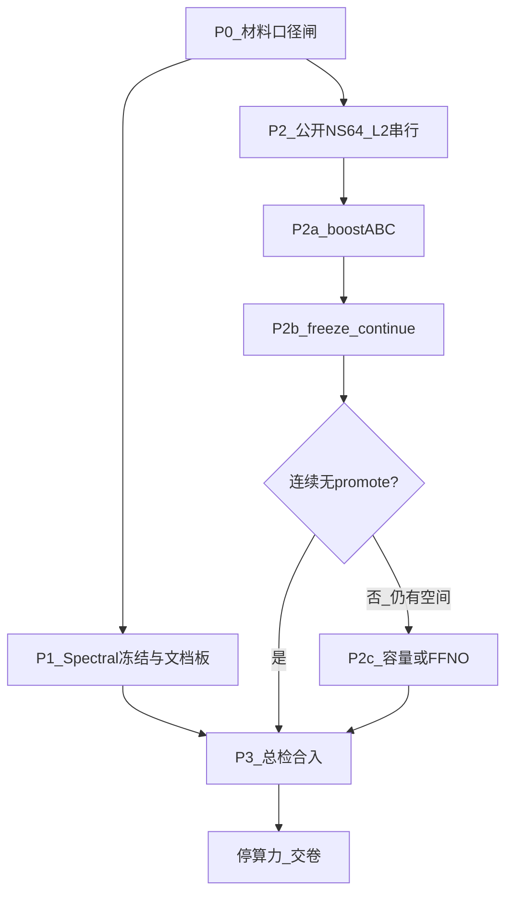

# OPT_MASTER_PLAN · 2026-07-31（落盘执行副本）

> **历史阶段文档**：P0–P3 已收尾。  
> **历史** · **现行**见 [`CURRENT.md`](CURRENT.md) · [`OPT_WAVE_MULTIAGENT_PLAN_2026-08-03.md`](OPT_WAVE_MULTIAGENT_PLAN_2026-08-03.md)（主报 `freeze_r9` / L2 0.035302 · v8）。  
> 中间链：Innovation → ROUND2…ROUND6（均为历史接棒）。  
> 工作区：`/workspace/ai4s-f` · 合入：`/workspace/ai4s/submission`

## 执行状态（滚动 · 2026-08-01 22:48 收尾；主报后续由 Innovation/Round2 更新）

| 阶段 | 状态 | 备注 |
|------|------|------|
| P0 材料口径闸 | **done** | 当时主报 **0.037520**（sq3b） |
| P1 Spectral 冻结 | **done** | 3.811/8.054/29.560 |
| P2a boost A→B→C | **done** | A→0.039612 → C→0.037820 |
| P2b / squeeze | **done / plateau** | 终值 **0.037520**；sq4a 无提升；sq4b 中止；跳过 sq4c/P2c |
| P2c 容量/F-FNO | **skipped** | 已 ≤0.038 优秀带 |
| P3 总检合入 | **done** | visualize 2026-08-01 + check PASS + pack/sync `ai4s` + tgz |
| 现场（本表冻结时） | **收尾完成** | 当时 0.037520；包 `fandougarden_submit_20260801_225003.tar.gz` |
| 现行主报 | **见 Round-2** | L2 **0.036576**（`multistep_probe`）；方针 [`OPT_ROUND2_PLAN_2026-08-02.md`](OPT_ROUND2_PLAN_2026-08-02.md) |

### 本会话续（启动门禁后按序）

1. `pgrep -af 'run_public_squeeze_loop|train_public_ns64_boost'`；保留现有链，等 `fno_public_squeeze_loop_final.json`
2. 主报真源：`summary.fno_ns.public_ns64` / `fno_ns_public_ns64_meta.json`（当前 **0.037519834** / tag `sq3b_freeze`）
3. sq4* 仅当公开 test L2 **< 0.037519834** 才 promote；同步 summary/results/disclosure/PPT/scp
4. 整轮 round4 无 promote → 停算力；P2c 跳过；P3：public visualize → `maintain_assets.sh check` → 合入 `/workspace/ai4s/submission/` → 旧口径扫描 → development_log + 本表勾选

---

# ai4s-f 双题优化总计划与方针（行动版）

> 地位：后续优化/提交的**唯一行动总方针**。与过时 run_log 冲突时，以本方针 + [`summary.json`](/workspace/ai4s-f/submission/results/summary.json) 主报字段为准。  
> 工作区：[`/workspace/ai4s-f`](/workspace/ai4s-f)（写）；合入：[`/workspace/ai4s/submission`](/workspace/ai4s/submission)。勿改 `ai4s-n`。  
> 依据：[Spectral](caa3e3d7-311c-4c2e-b4c0-bcbdadf348c1) · [FNO L2](6b01dbd5-bc4a-4cab-acdc-c583306c41d7) · [提交口径](ba95eb4a-373b-42a8-8981-5566faa19785) · [外部参考](2879b5c4-ec8c-4a74-bd97-4b92ecc3a9b1)

---

## 0. 总览：可行性与可执行性

### 0.1 为什么可行

| 方向 | 可行性 | 依据 |
|------|--------|------|
| 材料口径统一 | **高 / 立即执行** | 零 GPU；风险最高的是 PPT/scp 仍写伪官方 0.005 |
| Spectral 再抠 ms | **低（故意冻结）** | idle 已平台 3.811/8.054/29.560；墙在 irfft/C2R；SDK 无 Plan2d/融合 |
| 公开 NS64 压 L2 | **高 / 主战场** | boostA 中途已见 ~0.0398 vs 主报 0.041835；脚本链现成 |
| v2 再压 0.005144 | **否** | 同构已 FINAL；不进公开分 |
| F-FNO / 扩容 | **中 / 条件触发** | CPU 探针有；需重训；不挡必选 SpectralConv |
| NVIDIA 真融合抄袭 | **不可行** | 与 Biren suFFT 硬冲突 |

### 0.2 可执行约束（全程）

- 环境：每个 shell 先 `source .../brsw_set_env.sh`；`device=supa`；单卡，**禁止**与 `ai4s-n`/长训并发写 formal perf。
- 串行：同时只跑 **一条** CPU 重训或 **一条** GPU 正式测。
- Promote：**仅**公开集 `n_train=1000 / n_test=128 / seed=20260722` 的 test 相对 L2 严格更优才替换 primary。
- 正确性优先：Spectral rel ≤ 1e-4；FNO chain CPU↔SUPA ≤ 1e-4；未过不得进主表/PPT。
- 落盘纪律：每阶段结束更新 run_log +（若 promote）`summary.json` / `results.md` / `data_disclosure` 公开段；失败只留日志不污染 demo。

### 0.3 主报基线（验收对照用）

| 角色 | 指标 | 数值 | 源 |
|------|------|------|-----|
| FNO 精度主报 | public NS64 rel-L2 | **0.037520** | `fno_ns.public_ns64` / `fno_ns_public_demo.pt`（sq3b；续压中） |
| Spectral 性能主报 | idle 64/128/256 ms | **3.811 / 8.054 / 29.560** | `spectral_conv.perf` |
| Spectral 正确性 | worst rel | ~**2.17e-7** | accuracy 07-31 |
| 旁注（禁混） | v2 continue3 / 768 | 0.005144 / 0.002491 | legacy 字段 |

---

## 1. 方针红线（不可破）

1. **主报唯一源**：FNO → `fno_ns.public_ns64.relative_l2` + `checkpoint_primary`；Spectral → idle formal 三档。其它数字必须标「旁注/工程对照」。
2. **禁伪官方**：禁止把 0.005144 / 0.002491 / 0.008768 写成公开或官方成绩。
3. **禁 SOL 冒充**：`sol_gap_analysis` / SOL-ExecBench 仅分析页，不进得分依据句。
4. **禁假加速**：未过正确性的路径、争用脏测，不得写 summary。
5. **禁换算子定义交必选题**：必选 SpectralConv 保持 2D corner + SUPA kernel；F-FNO/AFNO 等只能作选修对照。
6. **停条件**：公开 L2 连续 **2～3** 条高价值线无 promote，或单轮 |ΔL2| &lt; **1e-5**；且 Spectral 无新 SDK API → 停算力，专清材料交卷。

---

## 2. 阶段 P0 · 材料口径闸

### 2.1 目标与可行性

- **目标**：展示层与 `summary` 主报完全一致，消除答辩/评审「披露造假」风险。
- **可行性**：高；不占 GPU；应在长训展示/打包前完成，可与 P2 训练**并行起草**，但 **promote 展示前必须闸完**。

### 2.2 详细优化点（文件级）

| 文件 | 必须改成 | 注意 |
|------|----------|------|
| [`PPT技术总览_2026-07-31.md`](/workspace/ai4s-f/submission/results/PPT技术总览_2026-07-31.md) | 主报 L2=**0.041835**（公开 NS64）；v2 0.005144 仅旁注 | 删「官方 L2=0.005144」表述 |
| [`demo/scp_description.md`](/workspace/ai4s-f/submission/demo/scp_description.md) | Spectral **3.811/8.054/29.560**；FNO 公开 L2 | 勿留 5.3/13.7/52 与 0.008768 |
| [`results.md`](/workspace/ai4s-f/submission/results.md) | §3.2/§5 与 §3.3 对齐公开主报 | 自相矛盾段整段改写 |
| [`data_disclosure.md`](/workspace/ai4s-f/submission/results/data_disclosure.md) | **文首**即公开 NS64；v2 降级为附录 | 头尾勿再打架 |
| [`fno_eval_protocol.md`](/workspace/ai4s-f/submission/skills/fno_eval_protocol.md) | 正式 L2=公开 NS64 1000/128 | 修正「正式=v2」 |
| [`phase_status.json`](/workspace/ai4s-f/submission/results/phase_status.json) `notes` | 同步 07-31 主报数字 | 可保留 phases.done |
| `summary.visualization.data` | 标 public NS64；图与 `fno_ns_public_demo.pt` 一致 | 若图仍是 v2 语义则重跑 visualize |
| Spectral 主表 | **选定 summary idle 版**写入 results | 与 3.818/8.014/29.343 噪声差二选一，注明 measured_at |
| 断链引用 | skills 中「赛道验收与提交清单.md」 | 改为实际存在的手册路径或删引用 |

### 2.3 注意事项

- 先改文案再谈「刷分」；口径错误比 0.001 L2 更致命。
- 合入主线时 `ai4s` 与 `ai4s-f` 同步改，避免一边新一边旧。
- `metrics_snapshot.md` 已较新，以其为文案锚，反推 PPT/scp。

### 2.4 验收指标（P0 Done）

- [ ] 全库检索：主叙述中无「官方/正式 L2 = 0.005」类句子（旁注区除外且带标签）
- [ ] PPT、scp、results、disclosure 文首、fno_eval_protocol、phase notes 五处以上口径一致
- [ ] 可视化字段与 public demo ckpt 一致
- [ ] Spectral 主表与 `summary.spectral_conv.perf` 一致（允许注明噪声复测）

---

## 3. 阶段 P1 · Spectral：冻结与护栏

### 3.1 目标与可行性

- **目标**：正式三档 ms **冻结提交**；防止后人重踩封死实验；文档板对齐 07-31。
- **可行性**：冻结决策已由 revisit 证实；再挖微优 ROI≈0。解冻仅当新 SDK。

### 3.2 已收割（勿重复劳动）

P2–P5 trunc/pack、P6 col_out cache、P7 dual scatter、P8b packed scale、R11 gather-scatter、R4–R7 链缓存/物化 —— 证据见 `opt_p*` / `opt_r*` / `opt_spectral_revisit_2026-07-31.md`。

### 3.3 封死清单（禁止重开）

`torch.fft@SUPA`；Hybrid torch.fft+mul；`BuildPlan2d`/`PlanMany`；strided pack CopyD2D；R12 transpose；R13 ping-pong；R14 fused IN+GELU；P8 污染 stage cache；跨 plan 共享 workArea；TurboFNO/TurboFFT CUDA 真融合；VkFFT/FlagGems 作热路径；训练占核时写 formal perf。

### 3.4 允许的维护动作

1. Idle GPU 下 `test_accuracy.py` + `test_perf.py`（contention：ms64&gt;12 跳过写 summary，已有护栏）。
2. multi-call 正确性护栏回归。
3. 文档债：[`spectral_chain_optimization.md`](/workspace/ai4s-f/submission/skills/spectral_chain_optimization.md)、[`sol_gap_analysis.md`](/workspace/ai4s-f/submission/skills/sol_gap_analysis.md)、`spectral_conv/README.md` 性能板改为 **3.811/8.054/29.560**，并标注 permute/Plan2d **已封死**。
4. （可选、一次结论）batch/布局级试探：预期噪声级；无 ≥2% 稳定收益则永久关闭。

### 3.5 注意事项

- Formal 表配置保持：B=4, Cin=32, Cout=64, modes=16×16, warmup=10, iters=100, CPU→CPU, sync wall-clock。
- 勿为 1% 破正确性或多调用毒化类缓存。
- SOL proxy 可更新叙事「C2R 墙」，不作为优化 KPI。

### 3.6 验收指标（P1 Done）

- [ ] 书面确认：Spectral 日常优化队列 = 空（仅护栏）
- [ ] 封死清单录入 `OPT_MASTER_PLAN` / dual_track B2
- [ ] chain/sol/README 性能板与 summary idle 一致
- [ ] 最近一次 idle accuracy PASS 且 perf 与平台噪声内（相对 P8b 3.807/8.001/29.162，单档相对偏差建议 &lt;3%）

---

## 4. 阶段 P2 · 公开 NS64 相对 L2（主战场）

### 4.1 目标与可行性

- **目标**：在合规划分下压低公开 rel-L2；短期带 **0.038–0.040**；站稳后 promote。
- **可行性**：高。现成链：[`run_public_boost_chain.py`](/workspace/ai4s-f/submission/fno_ns/run_public_boost_chain.py) + [`train_public_ns64_boost.py`](/workspace/ai4s-f/submission/fno_ns/train_public_ns64_boost.py)；数据 `fno_ns/data/navier_stokes_v1e-3_N1200_T20.pt`。
- **不可行/不做**：继续烧 v2；零样本 v2→公开（~0.41）；matched/multiwin/modes=12/naive wavg。

### 4.2 公共评测协议（每轮强制）

- 数据：公开 NS64；划分 1000/128；seed=`20260722`；T_in=10→T_out=1。
- 架构默认：width=32, modes=16, 4 Fourier layers（改容量须同步 loader/demo/bench）。
- 指标：test **相对 L2**；promote 阈值：`new_best < current_best`（严格小于）。
- 记录：`fno_public_boost_*_summary.json`、chain_state、development_log 一段。

### 4.3 P2a · boost 链 A→B→C

**执行顺序（禁止并行开多条）：**

| 步 | 内容 | 脚本意图 | 优化点 | 注意 |
|----|------|----------|--------|------|
| A | abs 头 + hf_weight≈0.35 + periodic roll；warm from public best | `run_public_boost_chain` stage A | 高频能量/周期 BC；中途曾 ~0.0398 | 后半段防过拟合回弹；**未 promote 前勿改正文** |
| B | residual 头 + hf + aug 从零 | stage B `--residual` | 针对更大帧差 | 权重与 abs 头不兼容；eval 必须同语义 |
| C | 对当前 best 低 lr continue | stage C | 挤尾数 | 边际递减；无提升不 promote |

**注意事项：**

- 入口：`python3 run_public_boost_chain.py`（或 `scripts/run_public_boost_autochain.sh`）；先看 `fno_public_boost_chain_state.json` 是否已在 A 中途。
- Promote 目标文件：`fno_ns_public_ns64_best.pt` / `fno_ns_public_demo.pt`；并写 `summary.fno_ns.public_ns64`、`relative_l2`、`checkpoint_primary`、`meta.notes`。
- smokeA（2ep）失败 ≠ 方法死刑；以完整 A 为准。
- CPU 长训时不要跑 Spectral formal。

**P2a 验收：**

- [ ] A/B/C 均有结束 summary（或明确 skip 原因）
- [ ] 若存在 `best < 0.041835`：已 promote 且 summary/results/disclosure/PPT 同步
- [ ] 若全程无 promote：书面记录「boost 平台」并进入 P2b/停条件计数
- [ ] 目标带：promote 后主报落入 **≤0.040** 为达标；**≤0.038** 为优秀

### 4.4 P2b · freeze / 低 lr continue（公开集）

**优化点：** 复用 v2 成功配方（freeze Spectral → 极小 lr → continue 交替），数据与 ckpt 全部切公开。

| 轮次建议 | lr 量级 | 注意 |
|----------|---------|------|
| freeze-spectral | 2e-6～3e-6 | 只训非谱层或按现有 `train_l2_freeze_polish` / `train_official_polish` 改 data root |
| continue | 5e-6～1e-5 | 短轮（≤50–80ep）；测试 L2 回升则 abort 该轮 |
| 可选 | 轻噪声 / 更稳 cosine | 来自 F-FNO 训练策略子集；**不动**必选算子 |

**注意事项：** 每轮只看公开 1000/128；768 旁注可记但不决策；连续两轮 |Δ|&lt;1e-5 记入停条件。

**P2b 验收：**

- [ ] ≥1 轮完整日志 + best/last L2
- [ ] promote 规则执行无误
- [ ] 停条件计数更新（0/1/2…）

### 4.5 P2c · 容量 / F-FNO（条件触发）

**触发：** P2a+P2b 后仍 ≥0.040 或停条件将满但仍想搏一搏。

| 线 | 动作 | 可行性 | 早停 | 注意 |
|----|------|--------|------|------|
| width=48 从零 | 公开集；同 loss 配方 | 中；v2 曾 abort≠公开否决 | ep30 仍明显差于当前 best → abort | promote 须改默认 width |
| modes=20 | 同上 | 中 | 同上 | formal Spectral 表仍 modes=16 |
| F-FNO | [`factorized_spectral.py`](/workspace/ai4s-f/submission/fno_ns/factorized_spectral.py) CPU 重训→可选 SUPA 1D | 中高工程 | L2 不优于 2D 则仅对照 | **禁止**替换必选 SpectralConv 定义；不进 formal ms 表 |

**不做：** AFNO/GNOT/LSM/Geo-FNO 换题；TFNO 抠 mul（mul 已噪声级）。

**P2c 验收：**

- [ ] 有明确 trigger 记录
- [ ] 早停规则被遵守（无无效长训烧到底）
- [ ] 若 promote：全链路 width/modes/推理一致；否则仅对照日志

---

## 5. 阶段 P3 · 总检、合入、交卷

### 5.1 执行清单

1. `cd submission && ./scripts/maintain_assets.sh check`（相关 phase；submit_gate 资产一致）。
2. 复跑：Spectral accuracy；FNO chain consistency；公开 L2 复评（固定 seed）。
3. 合入 `/workspace/ai4s/submission/`：源码、summary、results、demo、skills、boost 脚本（若仍用）。
4. 打包前 **旧口径零残留扫描**（rg：`0.005144`、`0.008768`、`5.302`、`generated_ns_like_v2` 作「正式」等）。
5. 落盘本方针副本：`submission/results/run_logs/OPT_MASTER_PLAN_2026-07-31.md`；回写 [`opt_dual_track_plan_2026-07-31.md`](/workspace/ai4s-f/submission/results/run_logs/opt_dual_track_plan_2026-07-31.md) 状态表（A1/A3/A4/B1 等改为真实状态）。

### 5.2 注意事项

- `ai4s/submission` 另有远端 `junfennie162-sketch/birensupa-spectralconv`；`ai4s-f` 的 `fandou-ai4s` origin 未必可达——合入以**本地目录同步**为准，不依赖 push。
- 大 tar 归档继续 gitignore，只同步 sha256/说明。

### 5.3 验收指标（P3 Done / 可交卷）

- [ ] 主报三件套一致：公开 L2 + Spectral idle 三档 + accuracy PASS
- [ ] PPT/scp/results/disclosure/protocol 无伪官方
- [ ] development_log ≥5 段且 ≥3 类（含本轮 boost/材料）
- [ ] `ai4s` 与 `ai4s-f` 关键提交文件对齐
- [ ] OPT_MASTER_PLAN 已落盘；停条件状态写明（继续搏 / 已停）

---

## 6. 全局 KPI 看板（执行中维护）

| KPI | 当前 | 阶段目标 | 失败/停止 |
|-----|------|----------|-----------|
| 公开 rel-L2 | **0.037520**（sq3b；sq4a≈ep61 未破） | ≤0.040 达标；≤0.038 优秀（已达） | 整轮无 promote / \|Δ\|&lt;1e-5 |
| Spectral ms | 3.811/8.054/29.560 | 保持噪声内 | 回退 &gt;3% 或正确性 FAIL → 回滚 |
| 口径一致性 | f 主材料已刷 0.037520；合入 ai4s 待 squeeze 收尾 | P3 全勾选 | 任一主材料伪官方 → 阻断打包 |
| 正确性门禁 | PASS | 始终 PASS | FAIL → 禁止 promote/写表 |

---

## 7. 文档债总表（随阶段关闭）

| 文档 | 问题 | 关闭阶段 |
|------|------|----------|
| PPT / scp | 伪官方 0.005、旧 Spectral | P0 |
| results / disclosure / fno_eval_protocol | 正式=v2 | P0 |
| phase_status.notes | R7 旧数 | P0 |
| opt_dual_track_plan | A1「进行中」、A3/A4「待跑」、偏 v2 | P3 回写 |
| spectral_chain / sol_gap / spectral README | 板仍 5.3/13.7/52；开放项未关 | P1 |
| summary 内部字段 | `rel_l2` 0.00249 易误读 | P0/P2 promote 时注释强化 |

---

## 8. 确认后落地动作（Agent 模式）

用户确认本方针后：

1. 写入 [`OPT_MASTER_PLAN_2026-07-31.md`](/workspace/ai4s-f/submission/results/run_logs/OPT_MASTER_PLAN_2026-07-31.md)（与本计划同步）。
2. 按 **P0 → P1（文档）→ P2a** 开工；P0 与 P2a 可部分重叠但展示以 P0 闸为准。
3. 每完成一阶段勾选本节验收清单，再进入下一阶段。
